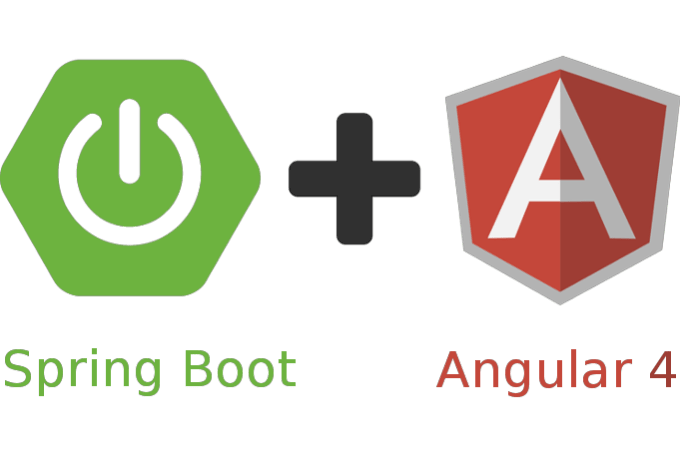

<p align="center">
  <a href="" rel="noopener">
 </a>
</p>

<h3 align="center">Projeto do Curso de Fullstack em Spring e Angular da Algaworks.</h3>

<div align="center">

[]()
[]()
[]()
[]()
[](/LICENSE)

</div>

---

## 📝 Conteúdo
<p align="center">
<a href="#about">Sobre</a>&nbsp;&nbsp;&nbsp;|&nbsp;&nbsp;&nbsp;
<a href="#installing">Instalando</a>&nbsp;&nbsp;&nbsp;|&nbsp;&nbsp;&nbsp;
<a href="#built_using">Construído Utilizando</a>&nbsp;&nbsp;&nbsp;|&nbsp;&nbsp;&nbsp;
<a href="#authors">Autor</a>
</p>


## 🧐 Sobre <a name = "about"></a>
Todo
 
### Installing <a name = "installing"></a>

```
git clone https://github.com/fcsouza/algamoney-api.git

```

## ⛏️ Tecnologias Utilizadas <a name = "built_using"></a>

- [Spring Boot](https://spring.io/) - Server Backend
- [Angular](https://angular.io/) - Frontend
- [MySQL](https://www.mysql.com/) - MySQL


## ✍️ Autor <a name = "authors"></a>

- [@fcsouza](https://github.com/fcsouza)
